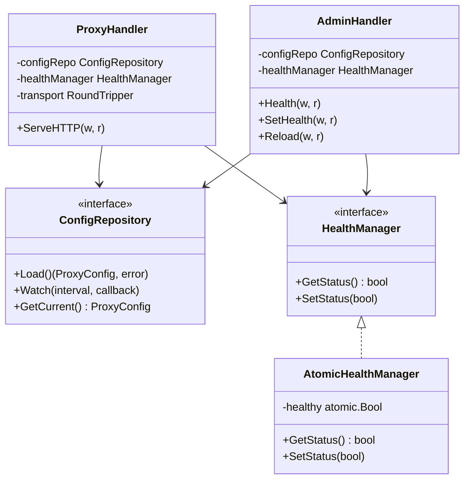
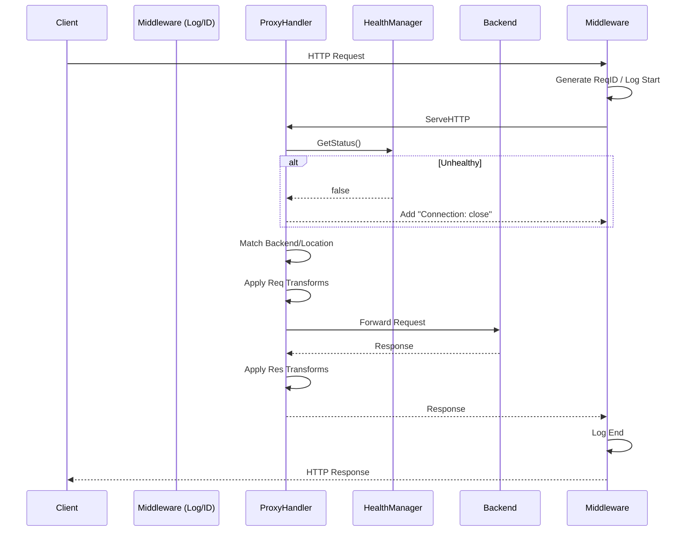

# 高性能 Go Proxy 設計書

## 1. 概要
本ドキュメントは、高性能かつ拡張性の高いGo言語製HTTPプロキシサーバーの設計について記述します。
本システムはClean Architectureを採用し、テスト容易性と保守性を高めた設計となっています。

## 2. アーキテクチャ
Clean Architectureに基づき、以下のレイヤー構造を採用しています。

```
/
├── cmd/
│   └── proxy/          # エントリーポイント (main.go)
├── internal/
│   ├── config/         # 設定読み込み・監視 (Infrastructure Layer)
│   ├── domain/         # ドメインモデル・インターフェース (Domain Layer)
│   ├── usecase/        # ビジネスロジック (UseCase Layer - 今回はHandlerに統合)
│   ├── interface/      # 外部とのインターフェース
│   │   ├── handler/    # HTTPハンドラ (Proxy, Admin)
│   │   └── middleware/ # HTTPミドルウェア (Auth, Logging, ID)
│   └── infrastructure/ # 技術的詳細の実装
│       ├── http/       # HTTPクライアント・トランスポート
│       ├── logger/     # ロガー
│       └── auth/       # 認証ロジック詳細
└── pkg/                # 汎用ユーティリティ
```

## 3. 機能設計

### 3.1. プロキシ処理
- **ストリーミング処理**: `net/http/httputil.ReverseProxy` を使用し、リクエスト/レスポンスBodyをメモリやディスクにバッファせず、ストリームとして転送します。これによりメモリ使用量を最小限に抑えます。
- **コネクションプール管理**:
    - バックエンドへの接続には `http.Transport` を使用し、Keep-Aliveを有効化してコネクションをプールします。
    - **要件対応**: 「一定時間利用されていない」または「10000件処理」した際に、`http.Transport` を再生成するカスタム `RoundTripper` (`RecreatingTransport`) を実装しました。これにより、長期稼働によるリソースリークや接続の陳腐化を防ぎます。

### 3.2. 設定管理
- **構成**: 設定ファイルは以下の2つに分割しています。
    - `server.yaml`: サーバー自体の設定（ポート、タイムアウト、管理ポートなど）。
    - `backends.yaml`: バックエンドのルーティング、認証、変換設定など。
- **ホットリロード**: 5分ごとに設定ファイルを監視し、変更があれば自動的に再読み込みを行います。
- **拡張性**: 設定読み込みは `ConfigRepository` インターフェース経由で行われるため、将来的にDBやKVSからの読み込みへの変更が容易です。

### 3.3. ルーティング & 変換
- **ルーティング**: リクエストパスの前方一致で適切なバックエンドおよびLocationを特定します。
- **変換処理**:
    - `header` タイプ: ヘッダーの追加・削除が設定ファイルで定義可能です。
    - `casis` タイプ: 独自の変換ロジック用プレースホルダー。
    - 複数の変換処理をリストとして定義し、順次適用します。

### 3.4. ミドルウェア
- **Correlation ID / Request ID**: 全リクエストに対して一意なID (`X-Request-ID`, `X-Correlation-ID`) を付与し、ログおよびバックエンドへのリクエストヘッダーに含めます。
- **構造化ログ**: `log/slog` を使用し、JSON形式の構造化ログを出力します。リクエストID、処理時間、ステータスコードなどを含みます。
- **認証**:
    - バックエンドごとに認証タイプ（Basic, JWT, OAuthなど）を設定可能です。
    - 現在はBasic認証の検証ロジックを実装済みです。

### 3.5. 管理機能 (Management API)
- 別のポート（デフォルト9095）で管理用APIを提供します。
- `/health`: ヘルスチェック用エンドポイント。
- `/reload`: 設定の手動再読み込み用エンドポイント。

## 4. データ構造 (Domain Models)

### ProxyConfig
```go
type ProxyConfig struct {
    Server   ServerConfig
    Backends []Backend
}
```

### Backend & Location
```go
type Backend struct {
    Name      string
    Locations []Location
    Auth      AuthConfig
    Transform []Transformation
}

type Location struct {
    Path       string
    BackendURL string
    Timeout    time.Duration
    Methods    []string
}

type Transformation struct {
    Type string                 // "header", "casis", etc.
    Req  map[string]interface{}
    Res  map[string]interface{}
}
```

## 6. クラス図 (Mermaid)



## 7. シーケンス図 (リクエスト処理フロー)



## 8. 今後の拡張性
- **認証**: JWTやOAuthの検証ロジックを `internal/infrastructure/auth` に追加することで容易に対応可能です。
- **設定ソース**: `internal/config/db_loader.go` などを実装し、`ConfigRepository` を満たすことでDB対応が可能です。
- **メトリクス**: Prometheus等のメトリクス収集用ミドルウェアの追加が容易な構成です。

## 9. ビルドと実行方法

### 9.1. 前提条件
- Go 1.21 以上

### 9.2. ビルド
```bash
# プロキシサーバーのビルド
go build -o proxy cmd/proxy/main.go
```

### 9.3. 実行
設定ファイル (`server.yaml`, `backends.yaml`) が必要です。

```bash
# 実行
./proxy --server-config server.yaml --backend-config backends.yaml
```

### 9.4. 開発用
```bash
go run cmd/proxy/main.go --server-config server.yaml --backend-config backends.yaml
```
